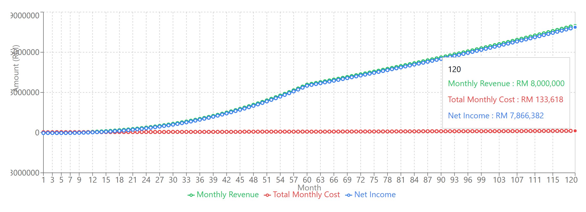
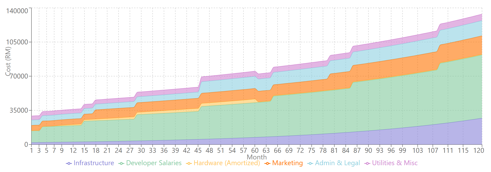
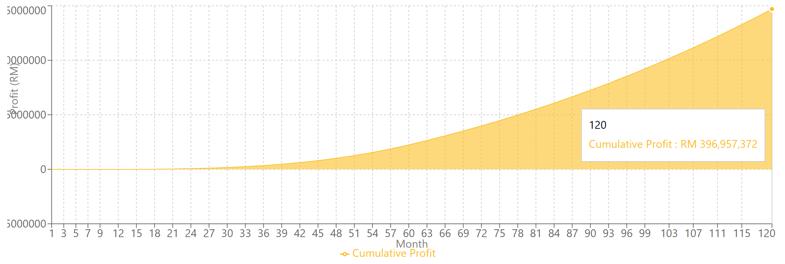

# 💰 PayPalm Financial Projections

This folder contains the 10-year financial forecast for the PayPalm biometric payment system, including key cost structures, revenue streams, and break-even analysis.

---

## 📊 Revenue vs. Costs

This chart illustrates monthly revenue and operating costs from Year 1 to Year 10, based on projected merchant adoption and transaction volume.

---

## 🧾 Cost Breakdown

Breakdown of monthly operating expenses, including:
- Developer team salaries (scaled with merchant base)
- Infrastructure & support costs
- Hardware provisioning (per merchant)

---

## 📈 Cumulative Profit Forecast

Cumulative profit turns positive in **Year 2**, with exponential growth through Year 10.

---

## ✅ Key Financial Outcomes

A high-level summary of business model performance and financial sustainability.

- Transaction fee: **0.05%** per transaction  
- Min RM 0.02, Max RM 0.25 per tx  
- Break-even by **Month 15**
- Positive monthly cash flow from **Year 2 onward**

---

## 📁 Source

These projections were generated using Claude with monthly compounding logic, adaptive team sizing, and scale-adjusted infrastructure costs. Full breakdown available upon request.

---
