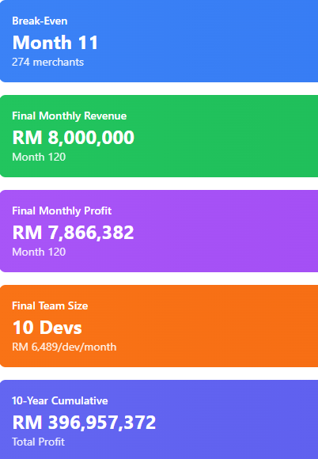

# 💰 PayPalm Financial Projections

This folder contains the 10-year financial forecast for the PayPalm biometric payment system, including key cost structures, revenue streams, and break-even analysis.

🔗 **Claude Artifact**:  
[View Full Financial Projection in Claude](https://claude.ai/public/artifacts/2d95476d-57f3-45ff-b905-064394ff8c95)

---

## 🧠 Key Assumptions Used

- **Growth Model**: S-curve scaling for merchants (2 → 10,000)  
- **Transaction Volume**: Linear growth from 1,000 → 8,000 transactions per merchant  
- **Fee Structure**: 0.05% per transaction, capped at RM 0.10, minimum RM 0.02  
- **Developer Team**: Grows from 3 → 10 developers, with 5% annual salary increase  
- **Hardware Cost**: RM 200 per merchant (amortized over 12 months for new merchants)  
- **Infrastructure**: 30% annual growth (compounded monthly)  
- **Additional Teams**: Marketing (1 → 3), Admin (1 → 2), Ops (1 fixed)

---

## ✅ Key Financial Outcomes

A high-level summary of business model performance and financial sustainability:

- Transaction fee: **0.05%** per transaction  
- Min RM 0.02, Max RM 0.25 per tx  
- Break-even by **Month 11**  
- Positive monthly cash flow from **Year 2 onward**

  

---

## 🧾 Cost Breakdown

Breakdown of monthly operating expenses, including:
- Developer team salaries (scaled with merchant base)
- Infrastructure & support costs
- Hardware provisioning (per merchant)

---

## 📈 Cumulative Profit Forecast

Cumulative profit turns positive in **Year 2**, with exponential growth through Year 10.

---

## 📊 Revenue vs. Costs

This chart illustrates monthly revenue and operating costs from Year 1 to Year 10, based on projected merchant adoption and transaction volume.

---

## 📁 Source

These projections were generated using Claude with monthly compounding logic, adaptive team sizing, and scale-adjusted infrastructure costs.  
👉 [Full interactive model here](https://claude.ai/public/artifacts/2d95476d-57f3-45ff-b905-064394ff8c95)
