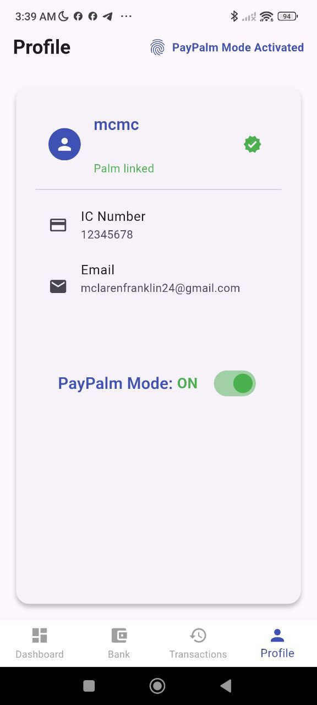
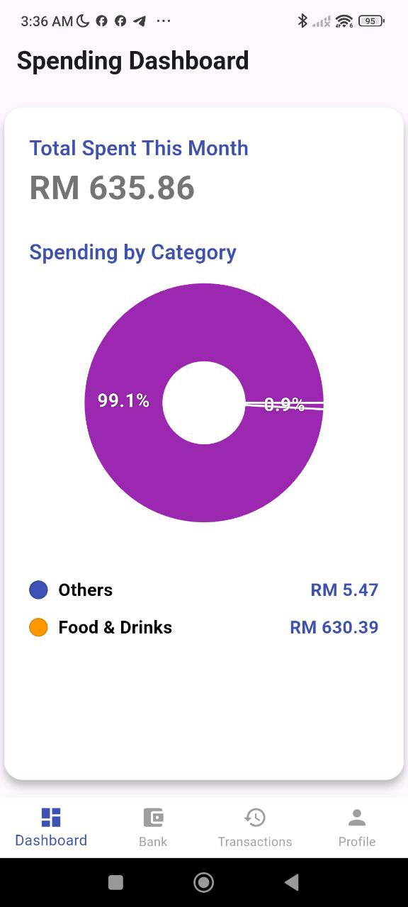
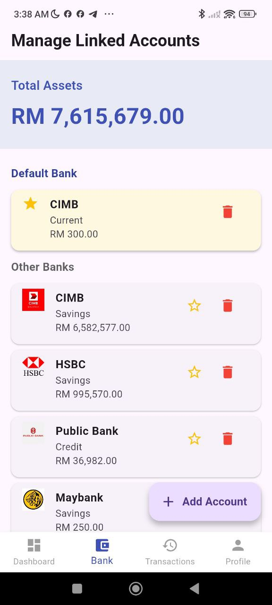
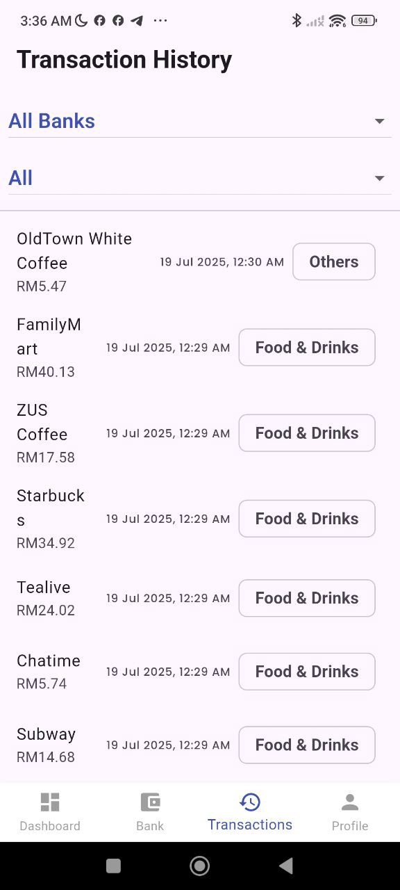

# 📱 PayPalm User App

The PayPalm mobile app enables users to seamlessly register, link their bank accounts, monitor spending habits, and view palm-based transaction history — all in one place.

---

## 🌟 Features

- 🔐 **Palm Registration Onboarding**  
  Users can securely link their identity and palm via QR code scanning at a kiosk.

- 🏦 **Bank Management**  
  Easily link one or more bank accounts or wallets and choose your default payment source.

- 📊 **Spending Dashboard**  
  Track your monthly expenses and monitor spending patterns.

- 🧾 **Transaction History**  
  View real-time history of all PayPalm-authenticated payments — categorized and filterable.

- 🧠 **Smart Defaults (Coming Soon)**  
  Auto-switch payment sources based on context: groceries, transport, or international use.

---

## 📸 Screenshots

<p align="center">
  
</p>
<p align="center">
  
</p>
<p align="center">
  
</p>
<p align="center">
  
</p>

---

## 🛠️ Tech Stack

- Flutter 3.x (Dart)
- Firebase Auth & Firestore
- QR Scanner
- Local state & navigation

---

## 🔐 Security

- All palm authentication happens externally via hardware (Raspberry Pi / POS)
- The app only links user identity and preferred payment sources — no biometric data is stored on-device

---

## 🧪 Status

This app is a working MVP built for the PayHack 2025 challenge.  
Ongoing development is focused on:
- In-app notifications
- Budgeting insights
- Cross-border payment visualizations

---

## 📁 Folder Structure

/lib
/screens
/services
/widgets
/docs
*.jpg (UI screenshots)


---

## 📦 Setup Instructions

```bash
flutter pub get
flutter run
Ensure Firebase is initialized and .env is present if used.
